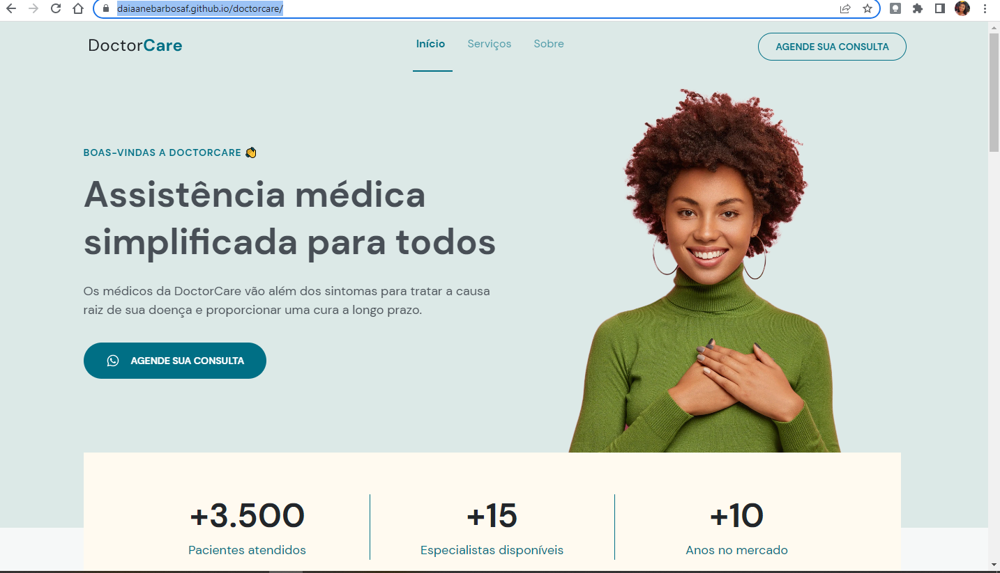

<h1 align="center"> Doctor Care </h1>

Esse projeto é a solução para uma boa comunicação entre os pacientes e médicos, criado durante a NLW8 Return.

  <a href="#-tecnologias">Tecnologias</a>&nbsp;&nbsp;&nbsp;|&nbsp;&nbsp;&nbsp;
  <a href="#-projeto">Projeto</a>&nbsp;&nbsp;&nbsp;|&nbsp;&nbsp;&nbsp;
  <a href="#-layout">Layout</a>&nbsp;&nbsp;&nbsp;&nbsp;&nbsp;&nbsp;

## 🚀 Tecnologias

Esse projeto foi desenvolvido com as seguintes tecnologias:

- HTML e CSS
- JavaScript

## 💻 Projeto

Essa projeto é a solução para uma boa comunicação entre os pacientes e médicos, criado durante a NLW8 Return.

## 🔖 Layout

Você pode visualizar o layout do projeto através [DESSE LINK](https://www.figma.com/file/F9AdRCJdx9OLNxFvPoID1Y/DoctorCare-(Community)?node-id=0%3A1). É necessário ter conta no [Figma](https://figma.com) para acessá-lo.
